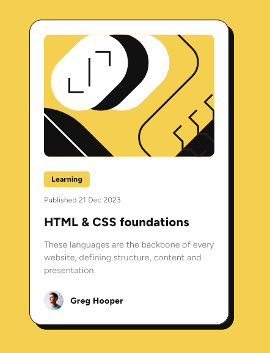
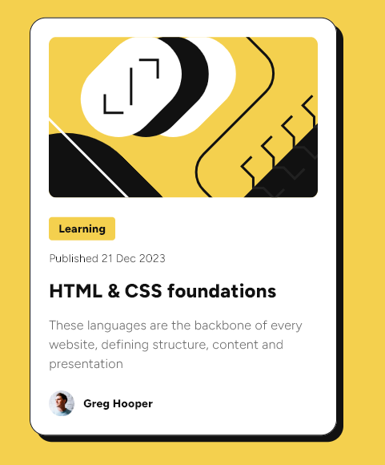

# Frontend Mentor - Blog preview card solution

This is a solution to the [Blog preview card challenge on Frontend Mentor](https://www.frontendmentor.io/challenges/blog-preview-card-ckPaj01IcS). Frontend Mentor challenges help you improve your coding skills by building realistic projects.

## Table of contents

- [Overview](#overview)
  - [The challenge](#the-challenge)
  - [Screenshot](#screenshot)
  - [Links](#links)
- [My process](#my-process)
  - [Built with](#built-with)
  - [What I learned](#what-i-learned)
  - [Continued development](#continued-development)
  - [Useful resources](#useful-resources)
- [Author](#author)

## Overview

### The challenge

Users should be able to:

- See hover and focus states for all interactive elements on the page (not implemented)

### Screenshot

### Links

- Solution URL: [Solution](https://github.com/JustANipple/blog_preview_card)
- Live Site URL: [Live site](https://blog-preview-card-ecf6c.web.app/)

## My process

### Built with

- [Flutter](https://flutter.dev/) - Flutter docs
- [Dart](https://dart.dev/guides) - Dart docs

### What I learned

I tried for the first time to build a project with Flutter. The idea of building an app that works on every platform interests me, so i tried to do something simple, but it was still challenging
I learned a lot just by trying to centralize styling, adding responsiveness and trying to make everything as a widget

### Continued development

Next time i'd like to make some transition and animation on user action

### Useful resources

- [Flutter](https://docs.flutter.dev/) - These docs have nice interactive guides to get started with Flutter features to handle layout, responsiveness, animation and transitions
- [Dart](https://dart.dev/) - This is the base of Flutter

## Author

- Frontend Mentor - [@JustANipple](https://www.frontendmentor.io/profile/JustANipple)
